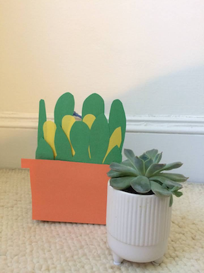

# About the project

A low-cost electronic fungus gnat catcher. The catcher has two settings:
 *  User can turn the catcher on at any time by pressing a push-button, which controls one set of yellow lights (LEDs)
 *  The catcher will turn on automatically in low light settings (say, nighttime) and off in high light settings (during the day) -- this feature controls a second, independent set of white lights (LEDs)
 
# Materials

* [Video](https://youtu.be/4O3Kp7wESNQ)
* [Circuit logic](https://annabelrothschild.com/images/gc-circuit.pdf), made with [Fritzing](https://fritzing.org/)
* [Code (Arduino)](https://github.com/annabelrothschild/Gnat-Catcher)

