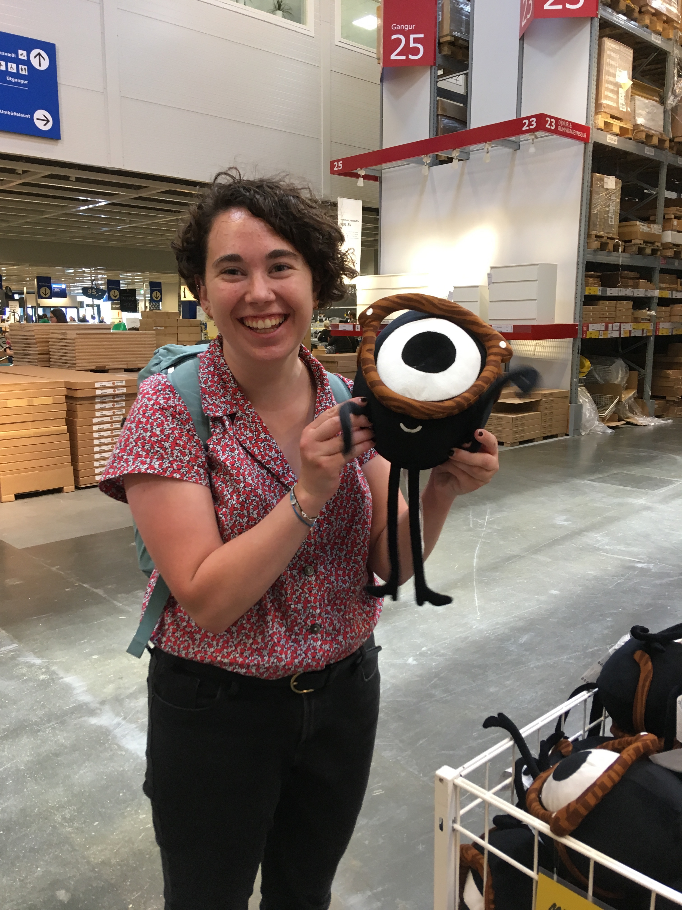

---
# Feel free to add content and custom Front Matter to this file.
# To modify the layout, see https://jekyllrb.com/docs/themes/#overriding-theme-defaults

layout: home
---

Hi, it's nice to _see_ you!

Hopefully one of the pages listed in the menu will have the information you're looking for, otherwise please email me: arothsch [at] wellesley.edu. 
