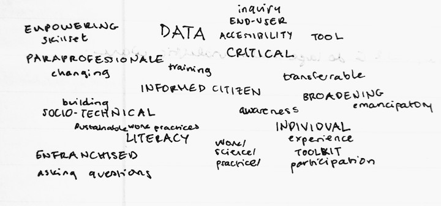

<i>My pronouns are <a href="https://pronoun.is/she">she/her</a>, profile image by <a href="https://www.linkedin.com/in/hershel-carbajal-rodriguez-290441151/">Hershel</a>.</i>

Hello! I'm a first year student in Georgia Tech's Human-Centered Computing PhD program. Previously, I studied CS at [Wellesley](https://www.wellesley.edu/cs). 

Currently, I'm thinking a lot about how to develop _(critical-) data literacy skills_ in informal learning environments and what it means to perform _data work_.

<!--  These are some words and phrases I can't stop saying right now (please excuse some curious spellings):

 -->

Outside of computer science, I'm often thinking about things on [this list](https://annabelrothschild.com/personal/art/) or outdoors. Aside from English, my French is B2/C1, and I am a habitual but poor student of  German & Swedish (both are A2 at best). Those are [CEFR](https://en.wikipedia.org/wiki/Common_European_Framework_of_Reference_for_Languages) scores, by the way. 

As for vital statistics, my blood-coffee content averages somewhere around 99% and my `sarcasm:serious` speech ratio is `100:1` (consider this fair warning).

