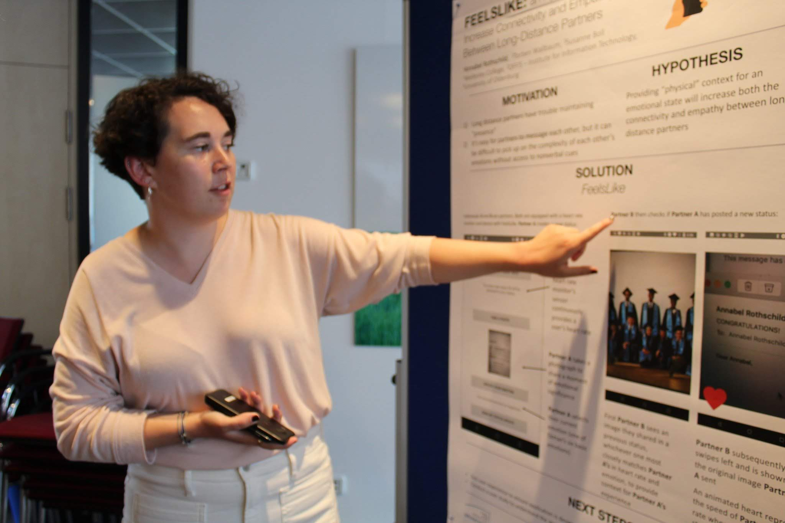

---
# Feel free to add content and custom Front Matter to this file.
# To modify the layout, see https://jekyllrb.com/docs/themes/#overriding-theme-defaults

layout: home
---

Hello, 

I am a computer science student at [Wellesley College](https://www.wellesley.edu/cs) outside of Boston, MA (USA). My [research page](https://annabelrothschild.com/research/) has more information about the kinds of projects I enjoy working on; generally, when programming languages and CS education converge, I'm a big fan. It's probably not a surprise then that I also take great joy in [teaching CS](https://annabelrothschild.com/teaching/) in voluteer and professional settings.

Outside of computer science, I enjoy hiking, biking, and [cool art](https://annabelrothschild.com/personal/art/). I am a 'native' English speaker, my French is B2/C1 and my German is barely A1.  

To contact me, please email me at either arothschild [at] wellesley [dot] edu. I also use an encrypted service: annabelrothschild [at] tuta [dot] io if you prefer.

This site is built with [Jekyll](https://github.com/jekyll/jekyll). [Impressum](https://annabelrothschild.com//impressum/).
