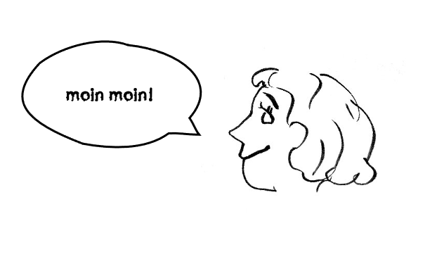

I am a PhD student at Georgia Tech, from August 2020. Before that, I studied CS at [Wellesley College](https://www.wellesley.edu/cs). A current(ish) copy of my cv is [here](https://docs.google.com/document/d/17xsQWARRODKBcnFjARglB1-IYF9KlgqcIHPTYt-Yz5A/edit?usp=sharing).

My research centers around data work: Who performs it, how it happens, and, more fundamentally, what we even consider the term to mean. An important part of answering these questions is understanding the originating context in which a dataset is assembled; I am interested in developing software systems that support documentation of such. I am a member of the [DataWorks](https://dataworkforce.gatech.edu/) research team. I also keep a running [list of books](https://annabelrothschild.com/books) that broadened (and/or challenged) my views on human agents in data-intesnsive systems. 

I also care quite a bit about data privacy. I keep a [spreadsheet](https://docs.google.com/spreadsheets/d/1eyy-YyFMA6gLla9F999hdHuxJlFO5M7G5hC9KW5bLS0/edit?usp=sharing) of the temporal and financial cost of protecting just my own personal information. This is also why I don't typically use a photo of myself on public-facing sites (unless required, in which case I make quite a fuss).

 
-------------------------------------------
 

My pronouns are <a href="https://pronoun.is/she">she/her</a>. The doodle is by <a href="https://www.linkedin.com/in/hershel-carbajal-rodriguez-290441151/">Hershel</a>. This site is built with Jekyll and hosted by GitHub pages.