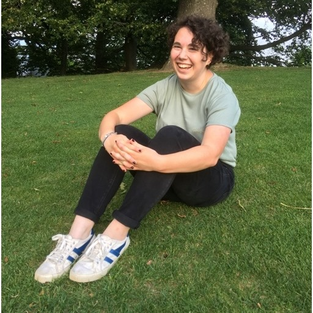

<i>My pronouns are <a href="https://pronoun.is/she">she/her</a>.</i> 

Hello, 

I'm an (incoming) first year student in Georgia Tech's Human-Centered Computing PhD program. I recieved my undergraduate degree in Computer Science from [Wellesley College](https://www.wellesley.edu/cs), along with a minor in Math.

My research interests broadly center around computing education and promoting computing literacy; my [research page](https://annabelrothschild.com/research/) has more information. I also enjoy actively [teaching CS](https://annabelrothschild.com/teaching/).

I try to share things I've learned about research broadly on [my blog](https://medium.com/me/stories/public) not because I claim to be an expert, but rather because I knew very little about research or applying to graduate school as I was starting those experiences. I put this information out there in the hopes it helps jump-start others' similar journeys :) If something I've done or am working on is of interest to you, please feel free to email me and I'd be happy to chat.
 
Outside of computer science, I enjoy hiking, biking, and [cool art](https://annabelrothschild.com/personal/art/). My first language is English, my French is B2/C1, my German & Swedish are terrible but in progress, maybe A2 at best (these are [CEFR](https://en.wikipedia.org/wiki/Common_European_Framework_of_Reference_for_Languages) scores).

